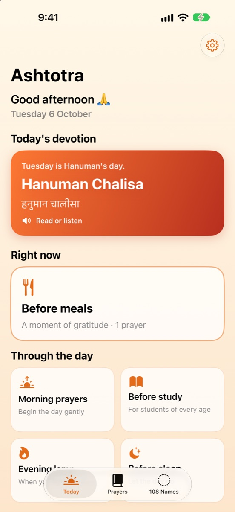
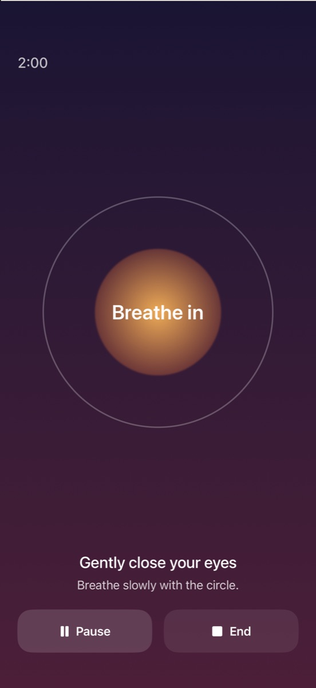
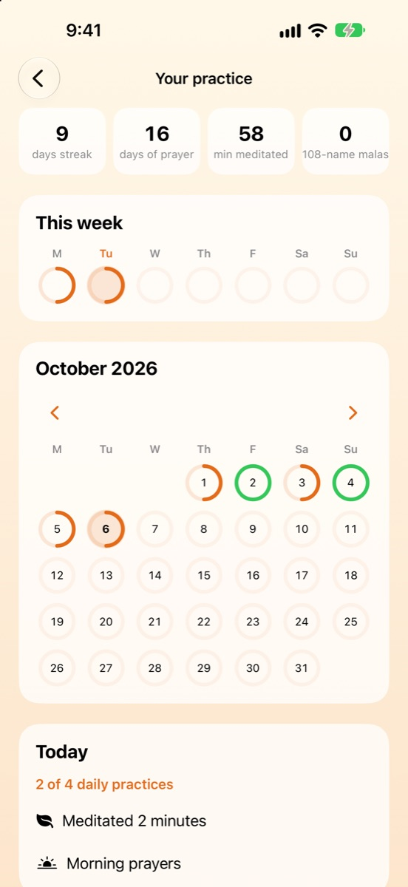
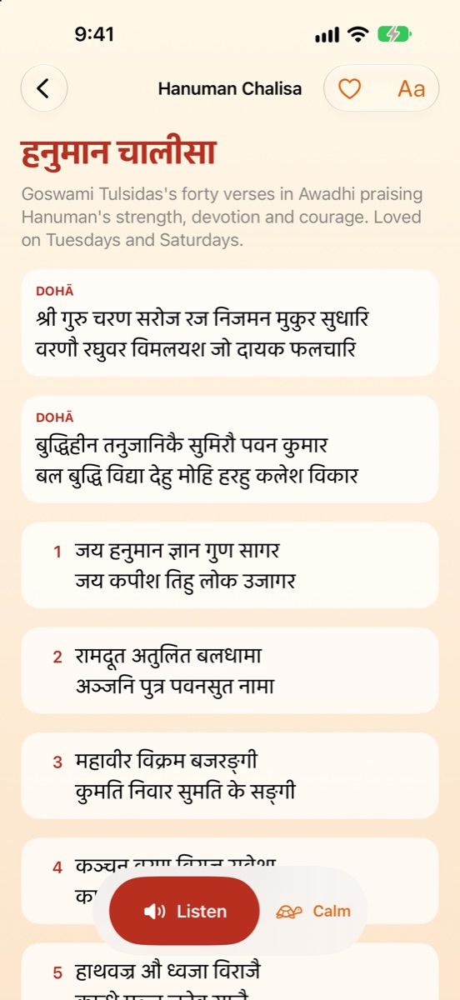

<p align="center">
  
</p>

<h1 align="center">Ashtotra</h1>

<p align="center"><b>Daily prayers, meditation and 108 sacred names, in your script. For iPhone, iPad and Android.</b><br>
Morning-to-night prayer routines, stotras like the Hanuman Chalisa and Aditya Hrudayam, the Om Jai Jagadish Hare aarti, and the 108 names of Ganesha, Shiva, Lakshmi and Saraswati. Read in English, IAST, Devanagari, Telugu, Kannada or Gujarati, or listen read aloud.</p>

<p align="center">
  
  
  
  
</p>

<p align="center">
  🌐 <a href="https://shruezee.github.io/Ashtotra-App/">Website</a> · 🔒 <a href="https://shruezee.github.io/Ashtotra-App/privacy.html">Privacy policy</a> · 🧪 Status: live 
https://apps.apple.com/au/app/ashtotra-daily-prayers/id1474584223
</p>

<p align="center">
  
  
  
  
</p>

## Version 3.0: a ground-up rewrite

Ashtotra first shipped in 2019 as a UIKit app that displayed bundled PDFs, with AdMob ads. Version 3.0 replaces all of it:

| | 2019 (v2) | 2026 (v3) |
|---|---|---|
| UI | UIKit, storyboards | SwiftUI, Observation |
| Content | 106 third-party PDFs | 23 prayers + 4 × 108 names as text, generated in 6 scripts |
| Audio | Streamed third-party recordings | Offline read-aloud with the system voice |
| Accessibility | Fixed-size PDF pages | Dynamic Type up to AX5, VoiceOver with per-script speech language, Reduce Motion |
| Privacy | AdMob + Firebase | No SDKs, no network, privacy manifest |
| Tests | One XCTest | Swift Testing suite over data integrity and progress logic |

## Features

- **Satsang together (SharePlay):** pray with family over FaceTime or Messages. The host shares a prayer (verse highlighted for everyone), the 108-name chant ring, a YouTube link, a video, a PDF or a photo; everyone follows in sync, and the host can mute a video for everyone else so the group can chant over it. A **satsang chat** with one-tap reactions (🙏 🌸 🪔 🕉️) runs over the same encrypted SharePlay channel; the host can pause chat or remove messages, and anyone can hide or report a participant. Joining is free; hosting is a one-time **Satsang Host** purchase, with the first satsang free
- **Today's practice:** a four-step daily checklist (morning prayers, the day's devotion, meditation, evening lamp) that fills in as you go, with a week of progress rings
- **Your practice:** streak, days of prayer, minutes meditated, a month calendar of rings, and what you did each day
- **Meditate:** 1–20 minutes (default 2), "gently close your eyes", a breathing circle, and a **haptic breath guide** that swells as you breathe in and fades as you breathe out; with a tanpura drone, singing bowl, silence, or your own devotional song (an MP3/M4A/MP4 from Files, or from Apple Music), ending with a bell
- **Today:** a greeting, the day's traditional devotion (Monday Shiva, Tuesday Hanuman, Friday Lakshmi…), the prayer routine for this time of day, and anything you were in the middle of
- **Daily routines:** morning, before study, before meals, evening lamp, before sleep: 17 short mantras with meanings
- **Stotras and aarti:** Hanuman Chalisa, Aditya Hrudayam, Ganesha Pancharatnam, Sri Suktam, Narayana Suktam, Om Jai Jagadish Hare
- **Listen:** read aloud offline with the device's Hindi voice, line by line with highlighting and auto-scroll; three paces
- **Chant mode** for the 108 names: one name at a time inside a 108-bead mala, or hands-free with Listen
- **Six scripts:** easy English, IAST, देवनागरी, తెలుగు, ಕನ್ನಡ, ગુજરાતી, switchable anywhere
- **Make it yours:** favourites, larger reading text, share a prayer, a gentle daily reminder, a soft day streak
- **Calm design:** warm gradients per deity, dark mode, iPad layout

## Engineering highlights

| Area | How it's built |
|---|---|
| Prayers | Stotras converted from the 2019 app's texts (Vignanam romanisation → IAST), typos fixed, sandhi joined correctly in Indic scripts (गुरुर्ब्रह्मा, पूर्णमदः); daily mantras and the aarti written out by hand and transliterated |
| Read aloud | `AVSpeechSynthesizer` with the best installed `hi-IN` voice speaking the Devanagari text, an `@Observable` `Reciter` publishing the current line so any screen can highlight and follow; replaces the 2019 app's third-party audio streams |
| Meditation sound | Tanpura and singing bowl synthesised in real time with an `AVAudioSourceNode` (plucked strings with jawari-like harmonics; inharmonic bowl partials with beating), so no recordings are bundled. "My devotional song" plays a track the user picks with `MPMediaPickerController` via the application queue player |
| Haptic breath | `CHHapticEngine` continuous events with intensity parameter curves: rising on the in-breath, still on the hold, fading on the out-breath, with a soft tap at each change |
| Tracking | `PracticeLog` keeps per-day activity sets (`routine:morning`, `prayer:…`, `chant:…`, `meditation`) and meditation minutes; `DailyChecklist` turns them into progress for rings and the calendar |
| Satsang | **GroupActivities**: a `GroupActivity` started in a FaceTime call or via `GroupActivitySharingController`; a `GroupSessionMessenger` carries a versioned, host-authored `SatsangState` (content, position, media clock, mute), and pure `SatsangRules` decide whose updates to follow and when followers re-sync; files travel through `GroupSessionJournal`. YouTube uses the official IFrame player in a `WKWebView`; videos use `AVPlayer`; PDFs use PDFKit |
| Purchases | **StoreKit 2** non-consumable with `Transaction.updates`, entitlement checks, restore, and a local `.storekit` configuration for testing |
| Reminders | One repeating `UNCalendarNotificationTrigger`, scheduled only after the user turns it on |
| Content pipeline | Names parsed from ITRANS-style romanisation → IAST → Devanagari, Telugu, Kannada and Gujarati with a deterministic transliterator. Typos corrected and every list cross-checked against a second source; Ganesha, Shiva, Lakshmi and Saraswati verified at all 108 positions |
| Data | One bundled `Ashtottara.json`, decoded into `Codable` models |
| State | `@Observable` `PracticeLog` persisted to `UserDefaults`; `@AppStorage` for settings |
| Accessibility | `AttributedString.languageIdentifier` so VoiceOver reads Devanagari in Hindi, Telugu in Telugu, etc.; named accessibility actions for next/previous; chrome capped at large sizes while the name keeps scaling |
| Screenshots | Debug-only launch arguments (`-demoRoute shiva -demoChant 11 -script telugu`) open any screen directly, so App Store screenshots are reproducible |
| Testing | **Swift Testing**: every list has 108 names, every script is filled, Indic scripts contain no stray Latin letters, progress clamps, streaks, persistence |
| Privacy | `PrivacyInfo.xcprivacy`: no tracking, no collected data, UserDefaults reason CA92.1 |

### Project structure

```
Ashtotra/
├── AshtotraApp.swift
├── Models/        Library (108 names), PrayerBook (prayers, routines, weekdays),
│                  PracticeLog, DailyChecklist, Reciter (read aloud), DailyReminder,
│                  Meditation, DroneSynth, BreathHaptics, DevotionalSong
├── Views/         Root tabs, Today, Prayers, PrayerReader, Routine, Meditate,
│                  MeditationSession, Journey, Names, Reader, Chant, Settings, Theme
└── Resources/     Ashtottara.json, Prayers.json
AshtotraTests/     Swift Testing suite
AppStore/          App Store screenshots and listing text
```

## Android

The Android app in [`android/`](android) is a native **Kotlin + Jetpack Compose** port with the same features and data:

| iOS | Android |
|---|---|
| SwiftUI, Observation | Jetpack Compose, Material 3, StateFlow |
| `Codable` JSON | kotlinx.serialization (same `Ashtottara.json` and `Prayers.json`) |
| `AVSpeechSynthesizer` (Hindi voice) | `TextToSpeech` with `UtteranceProgressListener` for line highlighting |
| `AVAudioSourceNode` synth | `AudioTrack` streaming the same tanpura and singing-bowl synthesis |
| Core Haptics breath curves | `VibrationEffect` amplitude waveforms (pulse fallback on phones without amplitude control) |
| `MPMediaPickerController` | Storage Access Framework picker with a persisted URI grant |
| `UNCalendarNotificationTrigger` | `AlarmManager` inexact daily alarm, re-armed after reboot |
| Launch screen + SwiftUI splash | Android 12 SplashScreen API + Compose splash |
| Swift Testing | JUnit tests over the shared JSON, practice log, checklist and breath phases |

Android 8.0+ (API 26), targets API 36. Build with `./gradlew assembleDebug` or open `android/` in Android Studio.

## Running it

1. Open `Ashtotra.xcodeproj` in Xcode 26 or later.
2. Select your own team under **Signing & Capabilities**.
3. Run on an iPhone or iPad simulator (iOS 17+). Run the tests with **⌘U**.

## Coming next

More 108-name lists (Hanuman, Rama, Krishna, Durga, Subrahmanya), each added only after it checks out at all 108 positions, and verse-by-verse meanings for the stotras.

## About

Designed and built by **Shruezee Studio**, the app studio of **[Shruthi](https://github.com/shruezee)**, an iOS developer in Sydney. See also [KindDose](https://github.com/shruezee/KindDose) and [MiniMingle Games](https://github.com/shruezee/MiniMingle-Games).

© 2026 Shruezee Studio
