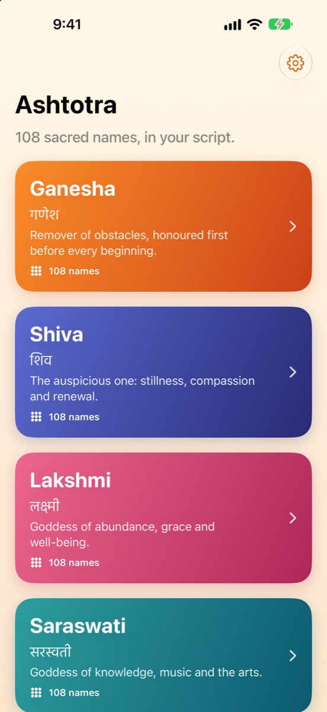
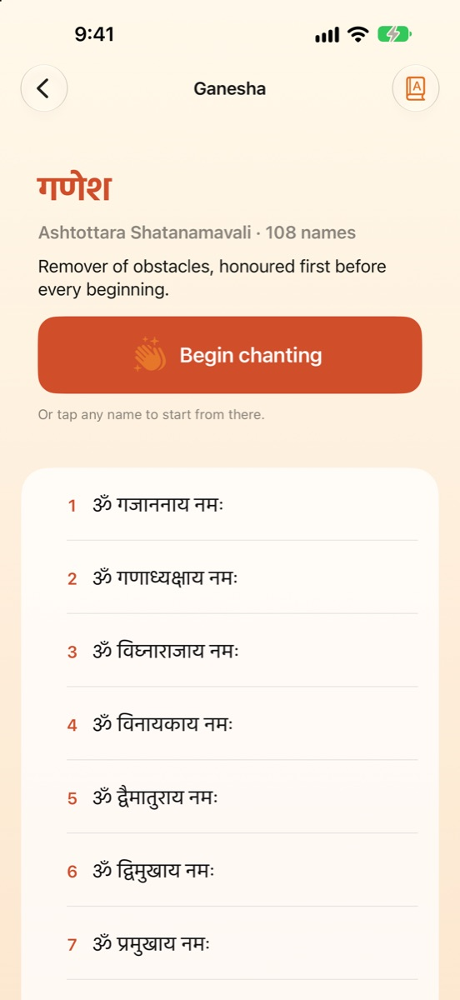
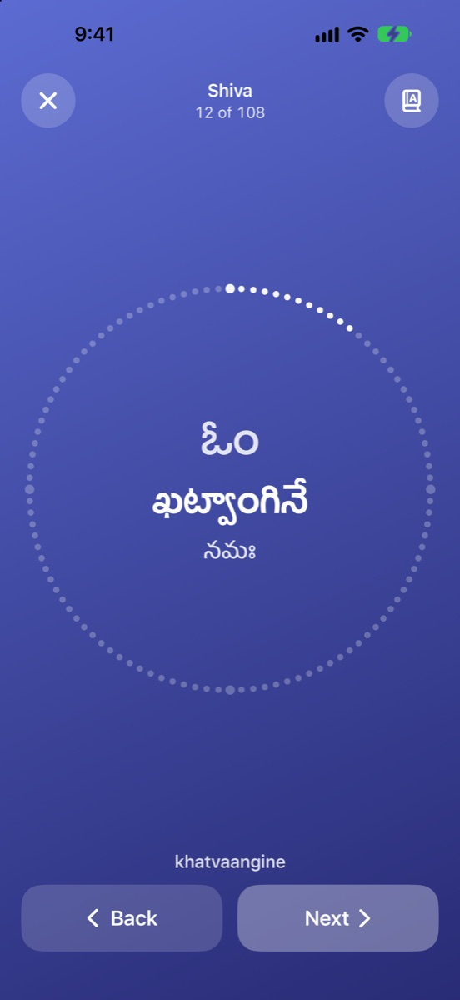
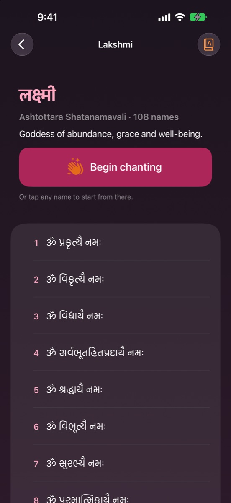

<p align="center">
  
</p>

<h1 align="center">Ashtotra</h1>

<p align="center"><b>108 sacred names, in your script.</b><br>
Read and chant the Ashtottara Shatanamavali of Ganesha, Shiva, Lakshmi and Saraswati in English, IAST, Devanagari, Telugu, Kannada or Gujarati.</p>

<p align="center">
  
  
  
  
</p>

<p align="center">
  🌐 <a href="https://shruezee.github.io/Ashtotra-App/">Website</a> · 🔒 <a href="https://shruezee.github.io/Ashtotra-App/privacy.html">Privacy policy</a> · 🧪 Status: submitted to the App Store (in review)
</p>

<p align="center">
  
  
  
  
</p>

## Version 3.0: a ground-up rewrite

Ashtotra first shipped in 2019 as a UIKit app that displayed bundled PDFs, with AdMob ads. Version 3.0 replaces all of it:

| | 2019 (v2) | 2026 (v3) |
|---|---|---|
| UI | UIKit, storyboards | SwiftUI, Observation |
| Content | 106 third-party PDFs | Text data for 4 × 108 names, generated in 6 scripts |
| Accessibility | Fixed-size PDF pages | Dynamic Type up to AX5, VoiceOver with per-script speech language, Reduce Motion |
| Privacy | AdMob + Firebase | No SDKs, no network, privacy manifest |
| Tests | One XCTest | Swift Testing suite over data integrity and progress logic |

## Features

- **Six scripts:** easy English, IAST, देवनागरी, తెలుగు, ಕನ್ನಡ, ગુજરાતી, switchable anywhere
- **Chant mode:** one name at a time with a 108-bead mala ring, tap/swipe/VoiceOver actions, gentle haptics, screen kept awake
- **Remembers your place** in every list, counts completions, and shows a soft day streak
- **Calm design:** warm gradients per deity, dark mode, iPad layout

## Engineering highlights

| Area | How it's built |
|---|---|
| Content pipeline | Names parsed from ITRANS-style romanisation → IAST → Devanagari, Telugu, Kannada and Gujarati with a deterministic transliterator. Typos corrected and every list cross-checked against a second source; Ganesha, Shiva, Lakshmi and Saraswati verified at all 108 positions |
| Data | One bundled `Ashtottara.json`, decoded into `Codable` models |
| State | `@Observable` `PracticeLog` persisted to `UserDefaults`; `@AppStorage` for settings |
| Accessibility | `AttributedString.languageIdentifier` so VoiceOver reads Devanagari in Hindi, Telugu in Telugu, etc.; named accessibility actions for next/previous; chrome capped at large sizes while the name keeps scaling |
| Screenshots | Debug-only launch arguments (`-demoRoute shiva -demoChant 11 -script telugu`) open any screen directly, so App Store screenshots are reproducible |
| Testing | **Swift Testing**: every list has 108 names, every script is filled, Indic scripts contain no stray Latin letters, progress clamps, streaks, persistence |
| Privacy | `PrivacyInfo.xcprivacy`: no tracking, no collected data, UserDefaults reason CA92.1 |

### Project structure

```
Ashtotra/
├── AshtotraApp.swift
├── Models/        Library (scripts, names, collections), PracticeLog
├── Views/         Home, Reader, Chant, Settings, Theme
└── Resources/     Ashtottara.json (4 × 108 names × 6 scripts)
AshtotraTests/     Swift Testing suite
AppStore/          App Store screenshots and listing text
```

## Running it

1. Open `Ashtotra.xcodeproj` in Xcode 26 or later.
2. Select your own team under **Signing & Capabilities**.
3. Run on an iPhone or iPad simulator (iOS 17+). Run the tests with **⌘U**.

## Coming next

Hanuman, Rama, Krishna, Durga, Subrahmanya and more. Each list is added only after it checks out at all 108 positions.

## About

Designed and built by **[Shruthi](https://github.com/shruezee)**, an iOS developer in Sydney. See also [KindDose](https://github.com/shruezee/KindDose) and [MiniMingle Games](https://github.com/shruezee/MiniMingle-Games).

© 2026 ShruthiRamKum
